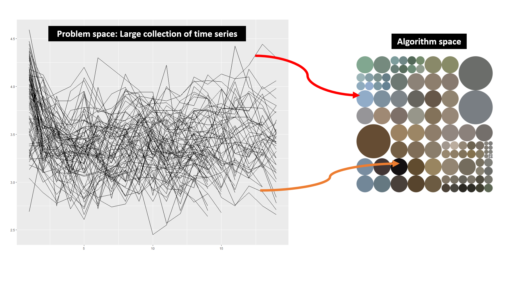
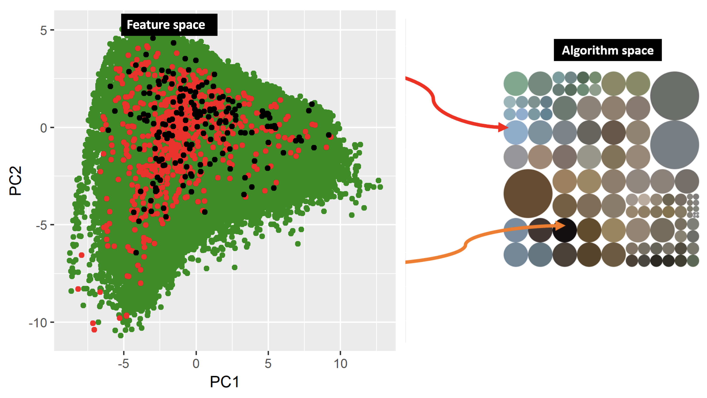

# Forecasting at scale
.pull-left[


]

.pull-right[


.small[Scope: Forecasting of millions of individual time series]
]

---

# Big picture




### Algorithms: **FFORMS**, **FFORMA**, **FFORMPP**
---


# Time series features

.pull-left[

```{r, message=FALSE, warnings=FALSE, echo=FALSE}
library(ggrepel)
library(tidyverse)
library(png)
library(tsfeatures)
library(ggpubr)
library(Mcomp)
library(patchwork)
data(M3)
# Extract required series
series_id <- c("N0001", "N0633", "N0625", "N0645","N1912", "N2012")
six_series <- lapply(M3[series_id], function(u){u$x})
p <- lapply(six_series,
function(u) {autoplot(u) + xlab("") + ylab("")}
)
for (i in seq_along(six_series))
p[[i]] <- p[[i]] + ggtitle(series_id[i])+theme(title =element_text(size=30, face='bold'))
(p[[1]]|p[[2]])/(p[[3]]|p[[4]])/(p[[5]]|p[[6]])

```


]

.pull-right[
```{r, message=FALSE, warnings=FALSE, echo=FALSE}
df <- tsfeatures(six_series, c("stl_features")) %>%
  select(trend, seasonal_strength) %>%
  rename(seasonality = seasonal_strength) %>%
  replace_na(list(seasonality = 0))
df$id <- names(six_series)
ggplot(df, aes(x = trend, y = seasonality)) +
  geom_point(size = 5, color = 'red') +
  xlim(0, 1) + ylim(0, 1) +
  coord_fixed() +
  geom_text_repel(
    aes(label = id),
    colour = "black",
    size = 10,
    box.padding = unit(0.5, "lines")
  ) +
  theme(legend.position = "none", text = element_text(size=20))
```

]

---

# Our approach




### **Can we trust ML-algorithms if we don’t know how it works?** 

---


# R package

.pull-left[


**available at: https://github.com/thiyangt/seer**

**Installation: **

```r
devtools::install_github("thiyangt/seer")
library(seer)
```

]

.pull-right[


Slides can be viewed at:: https://thiyanga.netlify.com


Slides created with [R Markdown](https://rmarkdown.rstudio.com) using the R package [**xaringan**](https://github.com/yihui/xaringan)


<a rel="license" href="http://creativecommons.org/licenses/by-sa/4.0/"></a><br />This work is licensed under a <a rel="license" href="http://creativecommons.org/licenses/by-sa/4.0/">Creative Commons Attribution-ShareAlike 4.0 International License</a>.


]
---